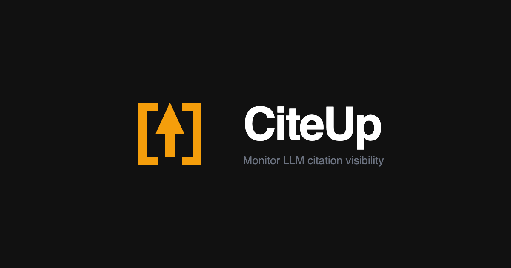

## About CiteUp

> Track when ChatGPT, Claude, Gemini, and Perplexity cite your brand. CiteUp is
the Search Console for AI platforms.

CiteUp is a monitoring and analytics tool that helps brands and organizations
track when large AI platforms—such as ChatGPT, Claude, Gemini, and
Perplexity—reference or cite their websites and content. Acting as a "Search
Console for AI," CiteUp gives you real-time visibility into how your brand
appears in AI-generated answers, research snippets, and suggested sources. This
enables you to measure your share of voice, monitor for misattribution or missed
citations, and gain insights into how AI systems perceive and represent your
brand online.

## Contact & Technical Details

- **Website:** [CiteUp](https://citeup.vercel.app)
- **Contact:** [assaf@labnotes.org](mailto:assaf@labnotes.org)
- **Focus:** Real-time monitoring of AI citations and brand visibility across major LLM platforms.
